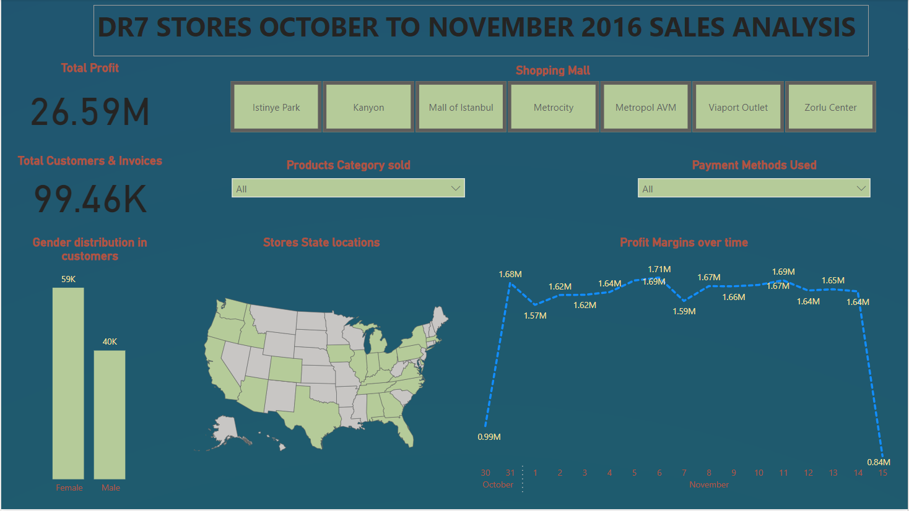

# **DR7-STORES ANALYSIS**

## **Introduction**
This is a power BI Project on a fictional time-series dataset of **DR7 STORES** The project is to analyze and drive insight to answer crucial questions and help make data driven decisions.
The dataset has data on orders placed by customers on a grocery delivery application.

**_Disclimer_** :_The dataset is designed with an assumption that the orders are placed by customers living in the United States of America_.

### **Problem Statement/Business Questions**
1.	Does time influence the number of customers coming into the shopping mall.
2.	What’s the Age influence on the performance of the stores.
3.	Does a payment method influence a customer’s spending and which product categories do they spend on most.
4.	Who should be the next target customer and for which product in the coming year

### **Skills/ concepts Demonstrated**.

The following skills were demonstrated, Data cleaning, Quick measures, Data Visualization, exploratory data analysis using Ms Excel and Power BI Tools.

### **Data Cleaning**.

The dataset was cleaned using Microsoft Excell 356 and when came in as CSV format and had to be changed into Excel Workbook format so that it can be saved and worked on properly. The dataset contains 99458 rows and 13 columns with titled invoice_no, invoice_date, customer_id, gender, age, category, quantity, selling_price_per_unit, cost_price_per_unit, payment_method, region, state, shopping_mall.

The had to split the invoice_date collum so that I obtain separate colllums for Date and Time using this formula (=INT(B2)) to obtain date into collum C2 as well as (=B2-C2) to obtain the time in collum D2 and then I applied Auto fill for the rest of the remaining 99456 rows. 

To determnine the performance of the store, A new column measuring profit per unit items had to be created subtracting selling_price_per_unit from cost_price_per_unit hence measuring total profit obtained by the shopping mall on each customer by Multiplying Profit per unit with quantity of the items bought by the customer.

**For accurate analysis, the decimal points weren’t changed to whole numbers**.

### **Data Visualization**

Upon cleaning the data was loaded into Power BI and 3 pages were created

**Home Page**

The home page is summarizing all the information needed to be know about the DR7 STORES, where they operate and what do they operate it.

**Profit Analysis**

**Sales Analysis**

You can interact with the report via this Link

https://app.powerbi.com/groups/me/reports/b60c5005-43c9-40ff-b2e9-b9f72876e833/ReportSection26b4bd0a85b4b6002396?ctid=2bcbd093-472a-4541-bab9-48ba15453410&experience=power-bi&bookmarkGuid=32528ecc-2799-4fc2-88e5-2c2a6bb83187

### **Conclusions and Recommendations**

- At some extent time affects the number of customers coming into the stores and its observed between 10am and 12:30pm the rate of incoming customers increases hence the store managers should ensure that the staff are always on high alert to attend to them and they get better services which can in one way or another increase the sales of the stores

- It is observed that Age of the customer greatly affects there shopping behaviors and its seen customers of ages 22, 37, 51 and 64 are spending a lot in the stores both on quantity and also buying the most expensive items compared to customers of ages 18, 20, and 32 whose spending has been down of the period of time hence strategies need to be put in place to ensure there shopping experience improves as well as the high spending customers experience shouldn’t be sabotaged and should always be target number one. 

- Its observed also customers prefer cash to any other payment method when shopping maybe because its easier and takes time than the process of using other payment methods, store managers should ensure that more information is given to customers about use of other methods as well as increasing card machines to smoothen the process of payments as this ensures that no losses happen to the store incase fake money is brought to the store.
